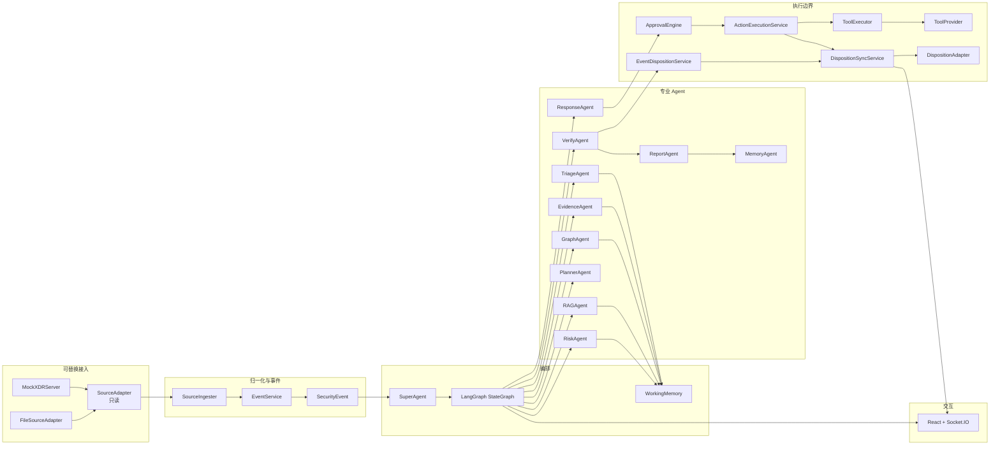

# ShadowTrace 项目总览

> **完成度：基础任务全部完成；创新任务完成 31/34 项。**  
> P1 部分完成（不计入 31）：031、061、089。P1 无「未完成」项。P2 不计入 34 项。

一句话定位：独立部署的通用多 Agent 安全运营智能体；Mock/文件/真实 XDR 可替换接入；与厂商 XDR 和具体大模型解耦。当前可演示闭环以 **Mock 契约** 为准，代码中没有已验证的真实深信服 XDR / 安全 GPT Adapter。

权威来源：仓库真实代码、测试、Makefile、Docker Compose、前端页面；其次 `README.md`、方案简介第 1–4 节与各 ISSUE 验收标准、`docs/deployment.md`、`contracts/`。下文不按方案文档宣称完成。

---

## 1. 总体架构

### 1.1 逻辑分层

三个可替换边界（代码均有基类 + Mock 实现；live 为 fail-closed 候选，不是已对接厂商）：

| 边界 | 职责 | 主实现 | 不得越权 |
|---|---|---|---|
| **SourceAdapter** | 只读接入 Incident/Alert/Asset/Log/Connector | `MockXDRSourceAdapter`、`FileSourceAdapter` | 不写回、不执行动作 |
| **ToolProvider** | 查询 / 实体处置（DIRECT_TOOL） | `MockToolProvider`；live 仅 `BaseToolAdapter` 候选 | 不得静默回退 Mock 后返回成功 |
| **DispositionAdapter** | 事件处置与最小结果同步 | `MockXDRDispositionAdapter`；`LiveDispositionAdapterStub` / `HttpDispositionAdapter` 能力默认 UNKNOWN | 分析正文永不写回 |

LLM 一律走 `LLMProvider`：`MockLLMClient` / `OpenAICompatibleLLMClient` / `CustomLLMClient`（协议基类，需 `custom_factory`）。Agent 不绑定厂商 SDK。

`execution_owner` 每个 Action 只能选一个：`XDR_MANAGED`（DispositionAdapter 提交）或 `DIRECT_TOOL`（ToolProvider 执行后只同步 `EXECUTION_RESULT_RECORD`）。禁止双下发。

### 1.2 运行时拓扑

**P0 硬依赖（`infra/docker-compose.yml` 无 profile 即启动）：** PostgreSQL 16 + pgvector、Redis 7、FastAPI 后端、React 前端、MockXDR（`:8100`）。

**闭环金路径额外依赖（`make up-demo`）：** Celery investigation worker、Beat + ingestion worker、可选 OTel/Prometheus/Grafana。

| 运行时对象 | 落点 |
|---|---|
| `SecurityEvent` / outbox / 审计 / pgvector | PostgreSQL |
| `EventContext` 热缓存、lease、checkpoint（`RedisCheckpointer`）、Pub/Sub `shadowtrace:events:{event_id}` | Redis（P0 硬依赖；无 Redis 不得宣称可恢复执行） |
| 编排状态机 | FastAPI 进程内 SuperAgent + LangGraph；生产调查走 Celery |
| 实时信封 | Redis Pub/Sub → Socket.IO 网关 → 前端 |

可选 profile：`--profile optional` 的 Neo4j / OpenSearch；**不是** P0/P1 硬前置。

### 1.3 核心数据流（P0 闭环 7 步）

1. **接入**：MockXDR / 文件 → SourceAdapter 归一化 → `EventService` 创建 `SecurityEvent`，冻结不可变 `source_snapshot`，保存当前来源状态与候选处置引用。来源可读 ≠ 可写。
2. **分诊**：`TriageAgent` 抽实体、定 `event_type` / 初始严重度；P0 注册 `RuleBasedFalsePositiveHook`，P1 叠加 `FalsePositiveMatcher`。
3. **证据**：`EvidenceAgent` 经 `ToolExecutor` 调查询工具；并发采集 + `ConflictDetector`；不足则 `collection_status=PARTIAL_DONE`。
4. **评分**：`RiskAgent` 六维加权 → `risk_score` / `severity` / 校准置信度；`VerdictResolver` 产出 `FinalVerdict`（与 `EventStatus` **正交**）。
5. **处置建议与审批**：`ResponseAgent` 按 CapabilityManifest 生成 L0–L5 计划（含 deferred `update_source_event_disposition`）；`ApprovalEngine`：硬门禁通过后 L0/L1 自动，L2+ 人工，L4/L5 永不自动。
6. **执行 / 写回 / 两阶段验证**：`ActionExecutionService` 只执行 IMMEDIATE；`VerifyAgent` 核验效果；`EventDispositionService.activate_and_submit` 激活 deferred，经 Outbox 提交唯一终态 `EVENT_STATUS_UPDATE`；再核验写回。`writeback_required`（业务义务）与 `writeback_readiness`（能否提交）正交；UNKNOWN **禁止盲重试**。
7. **报告**：`ReportAgent` 生成 15 章；`StateMachineService` 过 CLOSED 门禁后 `CLOSED`。

**14 态 `EventStatus`**（仅内部编排，见 `backend/app/models/enums.py`）：

`NEW` → `TRIAGING` → `COLLECTING_EVIDENCE` → `ANALYZING` → `SCORING` → `PLANNING_RESPONSE` → `WAITING_APPROVAL` → `EXECUTING_RESPONSE` → `VERIFYING` → `REPLANNING` → `CONTAINED` / `FAILED` → `REPORTING` → `CLOSED`。

**`FinalVerdict`**（`none` / `possible_false_positive` / `false_positive` / `confirmed_threat`）是判定标签，不是事件状态。高置信误报仍经合法路径到 `CLOSED`。

**CLOSED 硬门：** `disposition_policy=required` 时，当前闭环周期必须有且仅有一条终态 `EVENT_STATUS_UPDATE` 达到 `WritebackStatus.CONFIRMED`（active head 唯一约束）。分析内容、报告、Prompt、`decision_trace` **永不写回**。Mock 回执带 `simulated=true`；CLOSED 强证据集合为 `{readback_verified, manual_confirmed}`。前端 `WritebackBadge` / `simulated-receipt-warning` 把 Mock 回读与 live 已验证分开，不得画成同级绿。

官方演示：`make up-demo && make demo-full-loop`（`EVAL_REQUIRE_CLOSED=1`）。`bootstrap-demo` 默认不含 response，**不是** CLOSED 金路径。

### 1.4 目录与包映射

| 目录 | 职责 | ISSUE 簇 |
|---|---|---|
| `backend/app/models/`、`db/` | 领域模型、14 态、Alembic | 002–003、007 |
| `backend/app/api/v1/` | REST `/api/v1` | 004、038、063、066 |
| `backend/app/adapters/`、`mock_xdr/`、`ingestion/` | 只读接入 + 处置写回边界 | 010–012、016 |
| `backend/app/tools/`、`providers/tools/` | Registry、查询/处置/验证/回滚、ToolExecutor | 006、018–024 |
| `backend/app/agents/` | 11 Agent + BaseAgent；ToolAgent 落地为 ToolExecutor | 005、032–036、049、054、057、060、080 |
| `backend/app/orchestration/` | LangGraph、ReAct、checkpoint、lease、ConvergenceGuard | 048、052–056、062 |
| `backend/app/services/` | Event/StateMachine/Approval/Execution/Disposition/WM/Budget | 013–015、028–029、037、058–059A |
| `backend/app/rag/`、`core/llm/` | pgvector RAG、LLMProvider | 027、041–047 |
| `backend/app/tasks/`、`core/celery_*` | 可恢复调查任务 | 056 |
| `frontend/src/` | 看板/详情/审批/审计/报告/知识复核/大屏 | 067–077、081、085 |
| `contracts/` | OpenAPI、JSON Schema、Socket.IO | 004、040 |
| `infra/`、`scripts/`、`data/` | Compose、一键演示、场景包与知识种子 | 001、011、086–089 |
| `docs/deployment.md` | 部署与金路径口径 | 088 |

**后续加固（110+、295–314、362 等，不另开基础/创新清单）：** 把 Celery 租约/恢复、dynamic-eval CLOSED 门禁、副作用收敛、以及非 Mock CLOSED 的强确认证据（`readback_verified` / `manual_confirmed`）做成可回归的评测门，用来证明 P0 闭环不是文档宣称。

---

## 2. 基础功能全览（P0）

边界（全节适用）：**本阶段以 Mock 契约为准，不声称已对接真实 XDR。** live Adapter 能力默认 UNKNOWN，提交被阻断。

### 2.1 工程底座

- **能力：** monorepo 一键拉起；统一 `/api/v1`；14 态状态机；结构化错误码。
- **关键实现：** `infra/docker-compose.yml`；`api/v1/schemas.py`；`models/enums.py` `EventStatus`；`StateMachineService`；`ShadowTraceError` + `ERROR_CODE_REGISTRY`。
- **完成证据：** `make up` / `make test-ci-lite`；`tests/test_models/test_state_machine.py`（`len(EventStatus)==14`）；`tests/test_api/test_contracts.py`；`tests/test_core/test_errors.py`。

### 2.2 数据接入

- **能力：** 三个原方案场景包可 ingest 成 `SecurityEvent`；文件 fallback；来源对象与内部事件经 `source_event_link` 关联。
- **关键实现：** `MockXDRServer`；`insider_data_exfiltration` / `account_anomaly_fp` / `suspicious_domain_access`；`BaseSourceAdapter` / `BaseDispositionAdapter`；`SourceIngester`；`EventService`。
- **完成证据：** `tests/test_mock_xdr/*`；`tests/test_data_generators/test_scenarios.py`；`tests/integration/test_data_pipeline.py`；`make integration-test`。
- **边界：** 「张三内鬼」只存在于 `insider_data_exfiltration` 场景包；系统按通用 `event_type` 设计。后续又加了 host_compromise 等扩展包，不改变 P0 三包验收。

### 2.3 工具与执行

- **能力：** 开放工具目录；查询 / 处置 / 验证基线工具；超时、重试、熔断、审计。
- **关键实现：** `ToolRegistry`；`MockToolProvider`；`ToolExecutor` + `circuit_breaker` / `retry`；`ToolCallLogService`。
- **完成证据：** `tests/test_tools/test_registry.py` / `test_query_tools.py` / `test_response_tools.py` / `test_verify_tools.py` / `test_executor.py`。

### 2.4 Agent 研判主链

- **能力：** 分诊 → 证据（含冲突）→ 六维评分 → 15 章报告。LLM 失败走规则/模板降级，不静默改 Mock 冒充真实分析。
- **关键实现：** `BaseAgent.execute` 模板方法；`TriageAgent`；`EvidenceAgent` + `ConflictDetector`；`RiskAgent` + `VerdictResolver`；`ReportAgent` + `SECTION_SPECS`×15。
- **完成证据：** 各 `tests/test_agents/test_*_agent.py`；`tests/integration/test_e2e_basic_loop.py`。
- **15 章：** 事件概述、严重级别、风险评分、涉及账号/资产/进程/文件/外部地址、证据链、攻击故事线、攻击映射、已执行处置、验证结果、处置建议、附录索引。

### 2.5 编排与护栏

- **能力：** SuperAgent 持租约驱动 LangGraph；Planner 出计划；步数/振荡/重复工具/LLM 次数触顶强制收敛；产物字段按 owner 写入。
- **关键实现：** `build_investigation_graph`（`P0_NODE_SEQUENCE`）；`PlannerAgent`；`ConvergenceGuard`；`WorkingMemory.FIELD_OWNERSHIP`；`BudgetService`；`OutputGuard` / `OutboundDispositionGuard`。
- **完成证据：** `tests/test_orchestration/test_workflow_graph.py`；`tests/test_agents/test_super_agent.py`；`tests/integration/test_orchestration.py`；`tests/test_core/test_guardrails.py`（`no_analysis_content_outbound`）。
- **说明：** SuperAgent 内 `_freeze_source_snapshot` 仍有占位注释，但生产冻结由 `EventService._ensure_source_snapshot` 完成；ISSUE-054 验收（NEW→REPORTING、并发租约、039 四场景）已落地。

### 2.6 处置闭环

- **能力：** L0–L5 建议 → 审批 → 异步执行 → Outbox 可靠写回 → 两阶段验证 → 失败重规划（≤3）→ CLOSED。
- **关键实现：** `ResponseAgent`；`ApprovalEngine`；`ActionExecutionService`（CAS + `idempotency_key`）；`DispositionSyncService`（lease / active head）；`EventDispositionService`；`VerifyAgent`；`ReplanHandler`（`MAX_REPLAN_COUNT=3`）。
- **完成证据：** `tests/integration/test_e2e_response_loop.py`；`tests/test_services/test_event_disposition_service.py`；`test_concurrent_execute_same_idempotency_key_single_job`；`tests/test_mock_xdr/test_no_analysis_egress.py`；`make demo-full-loop`。
- **边界：** Mock `readback_verified` 且 `simulated=true` ≠ live 已验证。

### 2.7 前端最小面

- **能力：** 事件看板、详情（状态/裁决/写回徽章、研判概览）、Socket 刷新。
- **关键实现：** `EventListPage`、`EventDetailPage`、`socketClient.ts`、`WritebackBadge`。
- **完成证据：** `frontend/tests/pages/EventListPage.test.tsx`、`EventDetailPage.test.tsx`；`make frontend-test`。

### 2.8 部署

- **能力：** Compose 一键包；demo 含 worker。Windows 需 bash（Git Bash/WSL）跑 Makefile。
- **关键实现：** `make up` / `up-demo` / `bootstrap` / `down-v`；`docs/deployment.md`。
- **完成证据：** `tests/test_infra/test_health.py`；`test_makefile_demo_full_loop_invokes_eval_with_require_closed`。

### P0 完成表（50 项）

| ISSUE | 标题 | 判定 | 一行证据 |
|---|---|---|---|
| 001 | Monorepo + Compose 骨架 | 完成 | `Makefile` + `infra/docker-compose.yml`；`tests/test_infra/test_health.py` |
| 002 | SecurityEvent 与配套模型 | 完成 | `models/security_event.py`；`tests/test_models/test_core_models.py` |
| 003 | PostgreSQL Schema / Alembic | 完成 | `backend/migrations/`；`tests/test_db/test_migrations.py` |
| 004 | REST `/api/v1` 契约 | 完成 | `api/v1/*` + `contracts/openapi/openapi.json`；`test_contracts.py` |
| 005 | BaseAgent + agent_io | 完成 | `agents/base.py`、`models/agent_io.py`；`test_agent_schemas.py` |
| 006 | 开放工具契约 / Capability | 完成 | `models/tool_meta.py`；`test_tool_schemas.py` |
| 007 | 14 态状态机 + 工作流常量 | 完成 | `enums.py` + `workflow.py`；`test_state_machine.py` |
| 008 | ShadowTraceError 注册表 | 完成 | `core/errors.py`；`test_errors.py` |
| 010 | MockXDR HTTP 服务 | 完成 | `mock_xdr/api.py`；compose `mock-xdr`；`tests/test_mock_xdr/` |
| 011 | 三场景包 | 完成 | `data_generators/scenarios/{insider,account_anomaly_fp,suspicious_domain}` |
| 012 | Source/Disposition Adapter | 完成 | `adapters/source/base.py`、`disposition/base.py`、`mock_xdr.py` |
| 013 | Redis EventContext + EventBus | 完成 | `context_service.py`、`event_bus.py` |
| 014 | WorkingMemory 字段归属 | 完成 | `working_memory.py` `FIELD_OWNERSHIP`；`test_working_memory.py` |
| 015 | EventService | 完成 | `event_service.py`；`test_event_service.py` |
| 016 | 摄取管道 + 文件 fallback | 完成 | `ingestion/source_ingester.py`、`file_ingester.py` |
| 017 | 数据底座集成测试 | 完成 | `tests/integration/test_data_pipeline.py`；`make integration-test` |
| 018 | Tool Registry | 完成 | `tools/registry.py`；`test_registry.py` |
| 019 | 查询工具 | 完成 | `tools/query/*`；`test_query_tools.py` |
| 020 | Mock 处置工具 | 完成 | `providers/tools/mock_provider.py`；`test_response_tools.py` |
| 021 | Mock 验证工具 | 完成 | `tools/verify/*`；`test_verify_tools.py` |
| 023 | 工具调用审计 | 完成 | `tool_call_log_service.py`；`test_tool_call_log.py` |
| 024 | ToolExecutor 超时/重试/熔断 | 完成 | `tools/executor.py`；`test_executor.py` |
| 027 | LLMProvider mock/openai/custom | 完成 | `mock_client.py` + `openai_compatible.py` + `CustomLLMClient` 基类；`test_llm_client.py`（custom 为方案要求的协议基类，无厂商实现） |
| 028 | AgentTrace / 事件审计 | 完成 | `agent_trace_service.py`、`event_audit_log_service.py` |
| 029 | BudgetService | 完成 | `budget_service.py`；`test_budget_service.py` |
| 030 | OutputGuard | 完成 | `core/guardrails.py`；`test_guardrails.py` |
| 032 | TriageAgent | 完成 | `triage_agent.py`；`test_triage_agent.py` |
| 033 | EvidenceAgent 顺序采集 | 完成 | `evidence_agent.py` sequential；`test_evidence_agent.py` |
| 034 | 并发采集 + 冲突检测 | 完成 | `conflict_detector.py`；`test_evidence_concurrent.py` |
| 035 | RiskAgent 六维 + VerdictResolver | 完成 | `risk_agent.py`、`verdict_resolver.py` |
| 036 | ReportAgent 15 章 | 完成 | `report_section_builder.py` `SECTION_SPECS`×15 |
| 037 | StateMachineService | 完成 | `state_machine_service.py`；含 CLOSED 门禁 |
| 038 | 事件生命周期 API | 完成 | `api/v1/events.py`；`test_events_api.py` |
| 039 | 告警→报告集成测试 | 完成 | `test_e2e_basic_loop.py` |
| 048 | LangGraph StateGraph | 完成 | `orchestration/workflow_graph.py` |
| 049 | PlannerAgent | 完成 | `planner_agent.py`；`test_planner_agent.py` |
| 052 | ConvergenceGuard | 完成 | `convergence_guard.py`；`test_convergence_guard.py` |
| 054 | SuperAgent 编排接管 | 完成 | `super_agent.py` + EventLease；`test_super_agent.py` |
| 055 | 多 Agent 编排集成测试 | 完成 | `tests/integration/test_orchestration.py`；`make orchestration-test` |
| 057 | ResponseAgent L0–L5 | 完成 | `response_agent.py`；L5 有枚举/审批，默认计划以 L0–L4 工具为主 |
| 058 | 分级审批引擎 | 完成 | `approval_engine.py` |
| 059 | 执行 + Outbox 写回 | 完成 | `action_execution_service.py`、`disposition_sync_service.py` |
| 059A | EventDispositionService | 完成 | `event_disposition_service.py`；active-head 唯一 |
| 060 | VerifyAgent 两阶段验证 | 完成 | `verify_agent.py` IMMEDIATE + deferred CONFIRMED |
| 062 | REPLANNING ≤3 | 完成 | `replan_handler.py`；`MAX_REPLAN_COUNT=3` |
| 064 | 处置验证闭环 e2e | 完成 | `test_e2e_response_loop.py`；`demo-full-loop` |
| 067 | 前端脚手架 | 完成 | Vite + React Router；`make frontend-test` |
| 068 | 事件看板 | 完成 | `EventListPage.tsx` + Vitest |
| 069 | 事件详情 | 完成 | `EventDetailPage.tsx` + Vitest |
| 088 | Compose 一键部署 | 完成 | `make up` / `bootstrap` / `down-v`；`docs/deployment.md` |

**基础任务全部完成。**

---

## 3. 创新点总览

**基础任务全部完成；创新任务完成 31/34 项。**

部分完成（不计入 31）：**031**（压缩库有单测，生产未注入）、**061**（Saga 服务有单测，未进编排/UI）、**089**（无方案点名的三幕 `make demo`，官方入口改为 `demo-full-loop`）。

下列只写代码里能点开、能跑、能解释的点。

### 3.1 计入 34 项的可演示亮点

| 创新点 | ISSUE | 一句话价值 | 如何演示 | 代码锚点 | 计入 34 项 |
|---|---|---|---|---|---|
| 多 Agent 自主调查闭环 | 048/054/055（P0 底座）+ 图内 P1 节点 | SuperAgent 租约驱动 LangGraph，专业 Agent 按字段归属写 WM | `make demo-full-loop` 后打开事件详情看 Agent 轨迹 | `super_agent.py`、`workflow_graph.py` | 编排底座为 P0；图内 Graph/RAG 为 P1 |
| 可解释 decision_trace | 063（028 为 P0 基础） | 聚合 Agent/工具/状态为一条可回放轨迹 | 详情页审计面板或 `GET /api/v1/events/{id}/decision-trace` | `decision_trace_service.py`；`DecisionTraceTimeline` | 是（063） |
| 工具调用审计 | 023/024 为 P0；072 为前端 | 超时/重试/熔断留痕，页面可查 | `/tools-audit`；详情工具调用表 | `ToolExecutor`、`ToolAuditPage` | 是（072） |
| 证据冲突处理 | 034（**P0**） | 多源证据冲突显式检出，不静默合并 | 走证据充足场景，报告/证据列表看 conflict | `conflict_detector.py` | **否（P0）** |
| ReAct 只读补证 | 053 | 只读查询补缺口；失败回退固定计划；禁止创建/执行处置 | `REACT_ENABLED=true`（默认 false）后看 ReAct round | `react_engine.py` `ReadOnlyReActExecutor` | 是 |
| 攻击故事线 | 051/070 | 证据时间轴还原攻击过程 | 详情页时间轴；`GET /events/{id}/timeline` | `storyline_service.py`、`StorylineTimeline` | 是 |
| 误报识别 | 043/078 + P0 VerdictResolver | 案例库匹配 + 前置过滤，close_as_fp 不被高分覆盖 | 场景 `account_anomaly_fp`；看 `FinalVerdict=false_positive` | `FalsePositiveMatcher`、`case_kb_service.py` | 是（043/078） |
| RAG 知识增强 | 041–047 | pgvector 混合检索，无独立向量库 | `make load-kb` 后走完整调查；图在 evidence 后插入 `rag_node` | `rag/pipeline.py`、`hybrid_retriever.py`、`RAGAgent` | 是 |
| 实体关系图 | 050/071 | PostgreSQL 派生图，Neo4j 非必需 | 详情页图；`GET /events/{id}/graph`；e2e `graph.spec.ts` | `graph_agent.py`、`EntityGraph.tsx` | 是 |
| 异步可恢复执行 | 056 | Celery + Redis checkpoint，重启可 resume | `make up-demo`（`TASK_MODE=celery`）；`resume_from_checkpoint` 单测 | `investigation_tasks.py`、`checkpointer.py` | 是 |
| 输出质量与轨迹分析 | 065/066 | 质量评分 + trajectory 指标 API | `GET /events/{id}/trajectory`；审计页 `TrajectorySummary` | `output_quality_evaluator.py`、`trajectory_analyzer.py` | 是 |
| 记忆沉淀与治理 | 080/081 | CLOSED 后沉淀 CaseKB；人工 promote/reject | `/knowledge/reviews` | `memory_agent.py`、`KnowledgeReviewPage` | 是 |
| 实时状态流 | 040/075 | Redis Pub/Sub → 18 种信封（方案原 16 + 加固类型） | 调查进行中看 `AgentStatusPanel` / `AgentActivityFeed` | `event_bus.py`、`socketio_manager.py` | 是 |
| 分级审批 UI / 报告导出 | 073/074 | 人工批 L2+；15 章预览导出 | `/approvals`；详情报告 Tab；e2e `approval.spec.ts` / `report.spec.ts` | `ApprovalPage`、`ReportViewer` | 是 |
| 一键演示与金线回归 | 086/087 | 系统套件 + 轨迹快照 diff 门禁 | `make test-system`；`make test-regression` | `tests/system/`、`tests/regression/baseline/*.json` | 是 |
| CI 与工具集成收口 | 009/025 | 契约漂移 + 工具系统测进 CI | `.github/workflows/ci.yml`；`make test-tools` | `ci.yml`、`test_tool_system.py` | 是 |
| 处置影响评估 | 079 | 审批前评估 blast radius，约束自动批准 | 审批卡片/引擎集成测试 | `impact_assessment_service.py` | 是 |
| 回滚工具目录 | 022 | Mock 可 unblock/restore/cancel isolation | `pytest tests/test_tools/test_rollback_tools.py` | `tools/rollback/*` | 是 |

### 3.2 未计入 N 的 P1 缺口

| ISSUE | 判定 | 缺口 |
|---|---|---|
| **031** 上下文压缩 | 部分完成 | `PromptBudgeter` / `ContextCompressor` 与 `tests/test_core/test_context_compressor.py` 存在；`BaseLLMClient` 有 `message_budgeter` 钩子；**生产 `deps.py` 未注入**，调查主链仍走朴素截断 |
| **061** 回滚补偿 Saga | 部分完成 | `RollbackService.compensate` 有完整实现 + `test_rollback_service.py` 覆盖 CAS/`COMPENSATION_RECORD`；**LangGraph / CLOSED / 前端均未调用**；无 rollback REST。可 pytest 演示，不能当产品金路径 |
| **089** 一键三幕演示脚本 | 部分完成 | 方案点名的 `scripts/demo.py`、`demo_narration.py`、`docs/demo-guide.md`、`make demo` / `make demo-reset` **不存在**。官方可重复入口是 `make demo-full-loop` / `eval-full-loop`（脚本审批，禁止空等 `APPROVAL_TIMEOUT`），覆盖金路径但不是三幕讲解脚本 |

### 3.3 加分项（方案优先级为 P2，不计入 34 项）

| 能力 | ISSUE | 状态 | 证据 |
|---|---|---|---|
| 对话入口 Chatbot | 076 | 已落地 | `POST /api/v1/events/{id}/chat`；`EventChatPanel`；`EVENT_CHAT_ENABLED` / `VITE_EVENT_CHAT_ENABLED` 可关 |
| SOC 大屏 | 085 | 已落地 | `/dashboard` `SocDashboardPage`；`GET /api/v1/stats` |
| live Tool/Disposition 候选契约 | 026 | 契约完成，**未对接真实 XDR** | `tools/adapters/base.py`；`HttpDispositionAdapter` 能力 UNKNOWN；`LiveDispositionAdapterStub` 拒绝 submit |
| 检索降级 | 084 | 部分完成 | `search_service.py`：无 OpenSearch 时 ILIKE；`GlobalSearchBox` |
| Neo4j 镜像 / 路径发现 | 082/083 | 部分完成 | compose `--profile optional`；主路径仍是 PostgreSQL 派生图 |
| OpenTelemetry | 092 | 部分完成 | `make up-demo` 带 collector；核心 `make up` 默认关闭 |
| 增强演示脚本 / K8s | 090/091 | 未完成 | 无 `demo_extended.py`；无 `infra/k8s/` |

---

## 4. 关键技术

### 编排与智能体

| 技术 | 解决什么 | 本项目用法 |
|---|---|---|
| LangGraph `StateGraph` | 多阶段调查要可分支、可恢复，不能写成一次性脚本 | `build_investigation_graph`：triage→planner→evidence→(可选 rag)→graph→risk→response→approval→execute→verify→replan/writeback_recovery→report→close |
| 12 角色 + `BaseAgent` 模板方法 | 专业分工且统一计时/轨迹/护栏/预算 | 11 个 Agent 类 + `ToolExecutor`；`execute` 包装，`_run` 由子类实现 |
| ReAct | 固定计划之外补证据缺口 | 默认关闭；开启后仅 `ReadOnlyReActExecutor`，两次拒绝即停，失败回退固定计划 |
| `ConvergenceGuard` | 防振荡、防刷工具、防刷 LLM | `GLOBAL_MAX_STEPS=80` 等与 `MAX_REPLAN_COUNT=3`、`MAX_AGENT_RETRIES=2` 互为兜底 |
| `WorkingMemory` 字段归属 | 防 Agent 互相覆盖产物 | `FIELD_OWNERSHIP`；非 owner 写抛 `working_memory_unauthorized_write`；写回字段只允许 DispositionSyncService |
| LLM 降级 | 模型不可用时主链不断、不造假 | `LLM_MODE=mock` 才用 MockLLM；openai_compatible 全失败由 Agent 规则降级并标 `degraded`，禁止静默切 Mock |

### 可靠处置与写回（本项目最硬的技术点）

问题：分析可以错，处置不能「本地成功冒充已回写」，也不能把同一刀砍两次。

| 机制 | 用法 |
|---|---|
| Outbox + 租约 | PostgreSQL `disposition_outbox` 为事实源；worker 租约领取；HTTP 在事务提交后发出 |
| CAS / 幂等键 | Action job `ON CONFLICT DO NOTHING`；同键并发只成一单（`test_concurrent_execute_same_idempotency_key_single_job`） |
| active head | required 事件的 `EVENT_STATUS_UPDATE` 仅一条 `superseded_by_disposition_id IS NULL` |
| UNKNOWN 禁止盲重试 | 已提交但结果不明只能查证或人工 `resolve-unknown`，不能再点一次 |
| `writeback_required` ⊥ `readiness` | 义务由 `disposition_policy` 推导；能力不足标 `writeback_unsupported` 并阻断，不能把 required 改成 false |
| `XDR_MANAGED` vs `DIRECT_TOOL` | 单一 `execution_owner`；DIRECT_TOOL 只许 `EXECUTION_RESULT_RECORD`，禁止再映射成实体动作 |
| 两阶段验证 | IMMEDIATE 效果核验 → 激活 deferred → 终态写回 CONFIRMED |
| 分析永不写回 | `OutboundDispositionGuard.no_analysis_content_outbound` + Mock egress 测试 |
| 证据分档 | Mock：`readback_verified` + `simulated=true`；live CLOSED 强证据仅 `readback_verified` / `manual_confirmed` |

### 数据与检索

- **PostgreSQL + pgvector** 是唯一向量路径（知识库、混合 RAG），不引入独立向量库。
- **Redis**：热 `EventContext`、lease、checkpoint、Pub/Sub。
- **混合 RAG**：关键词 + 向量 + RRF / rerank；知识分 ATT&CK、误报/历史案例、Playbook。
- **规则 + LLM 双路径：** 分诊/评分/报告均可在 LLM 失败时用规则或模板；`VerdictResolver` 优先级固定，`close_as_fp` 不被 `risk_score>=70` 覆盖。

### 工程与交互

- FastAPI `/api/v1` + Pydantic v2；OpenAPI / JSON Schema 契约漂移门禁（`make check-contract-drift`）。
- Socket.IO 信封 18 种，payload 脱敏，不带 raw_result 秘密。
- Celery 可恢复调查；默认 `make up` 的 BackgroundTasks **不是** 官方 CLOSED 金路径。
- React 18 + TS + Vite + Ant Design；Playwright e2e 存在，CI 中 `frontend-e2e` 仅 `workflow_dispatch`（方案允许可选）。
- Docker Compose 一键 Mock 演示。

### 技术选型表

| 技术 | 用途 | 为何不用替代方案 |
|---|---|---|
| PostgreSQL + pgvector | 事务、outbox、图谱投影、向量检索 | 独立向量库会拆事务与检索一致性，P0 明确禁止 |
| Redis | checkpoint / 热缓存 / Pub/Sub | P0 硬依赖；内存 checkpoint 仅开发降级，不能当可恢复验收 |
| LangGraph | 有状态调查图 | 手写 if/else 难以 checkpoint、replan、租约恢复 |
| MockXDR 双向契约 | 开发期读+写 | 不以未证实的厂商私有 REST 为 P0 前置 |
| LLMProvider 三模式 | 模型可替换 | Agent 不 import 厂商 SDK；custom 留给未来安全 GPT |
| Celery + Redis broker | 异步可恢复 | FastAPI BackgroundTasks 进程重启丢任务 |
| Socket.IO over Redis | 实时状态 | P0/P1 不以 Kafka 为硬前置 |
| Neo4j / OpenSearch / K8s | P2 可选 | 主路径图用 Postgres；检索有 SQL 降级；单机 Compose 即可答辩 |

---

**答辩可讲的硬事实：** Mock 上可以从摄入走到 `CLOSED`，并且测试证明三件事——分析内容未出站、终态 `EVENT_STATUS_UPDATE` 已 CONFIRMED、同一幂等键未重复执行。真实 XDR 仍是 fail-closed 边界，不是已完成对接。
