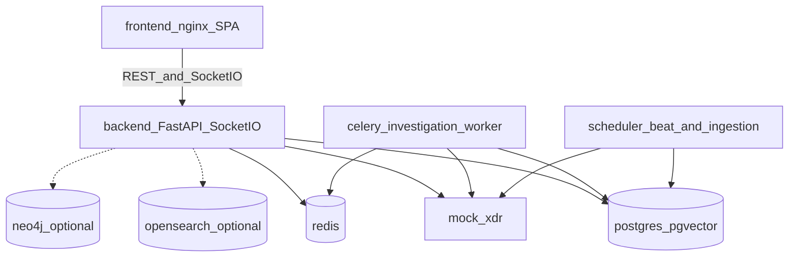
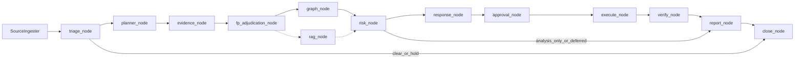

# ShadowTrace 架构

独立部署的多 Agent 安全运营系统：接入告警 → 分诊 / 取证 / 图谱 / 风险 →（可选）处置计划 → 人审 → 执行 → 写回验证 → 报告 → **仅当外部终态写回 CONFIRMED 才 CLOSED**。

- **评审 / 答辩**：读 §1–§3，看清定位、进程全景和一次调查怎么走完。
- **开发接手**：从 §4 起，按目录和文件改代码。
- **启动与验收命令**：见 [deployment.md](deployment.md)。权威产品契约（命名、状态、写回语义）见根目录 [README.md](../README.md) 第 1–4 节。仓库「现在怎么跑」见 [仓库运作说明.md](仓库运作说明.md)。

本文只描述仓库里能指到文件的事实，不写 ISSUE 流水账，也不用完成度分数。

---

## 1. 定位与边界

ShadowTrace 与具体 XDR 厂商、具体大模型品牌解耦。Agent 业务层禁止厂商 HTTP path、`dealStatus` / `uuId` 一类字段，也禁止绑定某一 LLM 商标。换数据源改 Adapter；换模型改 `LLMProvider`。

四个可替换边界（均有基类 + Mock；默认演示走 Mock 合同）：

| 边界 | 职责 | 默认实现 | 不得越权 |
|------|------|----------|----------|
| SourceAdapter | 只读接入告警 / 资产 / 遥测 | `MockXDRSourceAdapter`（`SOURCE_MODE=mock_xdr`） | 不写回来源；不把厂商字段漏进 Agent |
| ToolProvider | 查询 / 响应 / 验证 / 回滚 | Mock tools（`TOOL_MODE=mock`，演示常带 `SIMULATION_ENABLED=true`） | 副作用动作必须带明确 `execution_owner` |
| DispositionAdapter | 把获批处置写回来源对象 | `MockXDRDispositionAdapter`（`DISPOSITION_MODE=mock_xdr`，`KIND=mock`） | 研判正文、报告、Prompt、`decision_trace` **永不写回** |
| LLMProvider | 统一模型调用 | `LLM_MODE=mock`；可切 OpenAI-compatible | Agent 不直接绑厂商 SDK |

另有 [`FileSourceAdapter`](../backend/app/adapters/file_source.py) 走文件数据集摄入（`source_type=file`，写回 `not_required`），**不**走 `build_source_adapter` 的 `SOURCE_MODE` 开关；该工厂只认 `mock_xdr` / `sangfor_xdr`。Sangfor REST 合同在 [`contracts/vendor/sangfor_xdr`](../contracts/vendor/sangfor_xdr) 与 [`backend/app/adapters/sangfor/`](../backend/app/adapters/sangfor/)；能力 overlay **不得**套到 `KIND=mock`。本仓库默认可演示闭环是 **Mock 契约**（回执可带 `simulated=true`）。Cutover-Ready ≠ 真机验证，**不得声称已对接生产 XDR**。

副作用动作在 [`backend/app/models/action.py`](../backend/app/models/action.py) 上必须二选一：`XDR_MANAGED`（DispositionAdapter 提交实体动作）或 `DIRECT_TOOL`（ToolProvider 执行后只同步结果）。禁止双下发。`disposition_policy=required` 时，本周期须有且仅有一条终态 `EVENT_STATUS_UPDATE`（工具名 `update_source_event_disposition`）在 Adapter 上 **CONFIRMED**，才能 CLOSED。报告生成了不算结案。

---

## 2. 运行时全景

默认 Compose 见 [`infra/docker-compose.yml`](../infra/docker-compose.yml)。core 栈：Postgres + Redis + Mock XDR + backend + frontend。调查 worker / 摄入调度是 profile，不是默认进程。



| 组件 | 角色 |
|------|------|
| PostgreSQL 16 + pgvector | 事实库：事件、证据、动作、outbox、回执、向量 chunk |
| Redis 7 | lease、Celery broker/result、Socket.IO 桥、任务元数据 |
| Mock XDR | 独立 HTTP 服务（约 8100），演示源 + 处置写回目标 |
| backend | FastAPI + Socket.IO；**必须**挂 `socket_app`（[`backend/app/main.py`](../backend/app/main.py)），不要只跑裸 `app` |
| frontend | nginx 静态 SPA（Compose 3000）；本地 Vite 5173 把 `/api`、`/socket.io` 代理到 8000 |
| worker profile | Celery `-Q investigation`；任务名 `shadowtrace.run_investigation` |
| scheduler profile | Beat + 摄入 worker |
| optional profile | OpenSearch、Neo4j；图 Agent 无 Neo4j 可降级 |

`TASK_MODE`：core 默认 `background`（调查跑在 API 进程里，易失）；`make up WORKER=1` / demo 叠加 [`infra/docker-compose.worker.yml`](../infra/docker-compose.worker.yml)，把 API 钉成 `celery`。

---

## 3. 一次调查怎么走完

金路径场景是 `insider_data_exfiltration`（财务终端外传：账号 / 主机 / 压缩包 / 未批准域名）。**摄取必须走 Mock XDR + `SourceIngester`**（[`scripts/seed_mock_xdr_and_ingest.py`](../scripts/seed_mock_xdr_and_ingest.py)），不要手搓 `POST /events` 冒充金路径。

编排入口：`SuperAgent` 租约后跑 LangGraph（[`backend/app/orchestration/workflow_graph.py`](../backend/app/orchestration/workflow_graph.py)）。P0 主序列 `P0_NODE_SEQUENCE`：



要点：

- **分诊出口不止调查。** `route_after_triage` 可去 `planner`（继续调查）、`report` 或 `close`。`manual_hold` 条件边已布线但分诊门当前不返回它；`manual_hold` 的实际入口在 `verify` / `writeback_recovery` 的 `manual` 路由。Planner 也可在已有足够上下文时跳过取证，直接进 `response_node`。
- **RAG 不是 P0 序列里的必经节点。** 装配了 `rag_agent` 时，`fp_adjudication_node` 之后 **并行** 走 `rag_node` 与 `graph_node`，再汇入 `risk_node`；否则只走 graph。
- **编排专用节点**（无对应 Agent 类）：`fp_adjudication`、`approval`、`execute`、`close`。另有 `approval_wait`、`replan`、`writeback_recovery`、`manual_hold`、`begin_disposition_only`、`halt`。
- **MemoryAgent** 在 `close_node` 里触发结案后候选，不是图上的独立 P0 节点。
- 证据冲突由 [`ConflictDetector`](../backend/app/agents/conflict_detector.py) 三条固定跨源规则判定（身份无成功登录但 EDR 有进程；网络无明显外联但 DLP 有上传；资产已隔离但 EDR 仍活跃），命中条目置信度乘 `0.7`。前端证据表粉红行 / 「冲突证据」标的就是这些条目。
- `ORCHESTRATION_MODE=analysis_only` 禁止 `include_response_execution`；`risk_node` 之后可直接去报告，标记 `analysis_only_complete`。这不是 CLOSED。
- 全闭环要人审（脚本审批见 `scripts/dynamic_eval_approve.py`，不要空等 `APPROVAL_TIMEOUT`）→ 执行 → 验证 → 终态写回 CONFIRMED → `close_node`。

分析员在详情页看到的是同一事件的多个投影，**不是另一套状态机**。Hash Tab（[`EventDetailPage.tsx`](../frontend/src/pages/EventDetailPage.tsx)）：`source` → `timeline` → `graph` → `evidence` → `actions` → `writeback` → `audit` →（可选 `chat`）→ `report`。待办条「打开 × Tab」改 hash 并滚到 `#event-detail-tabs`。

---

## 4. 后端分层

包根 [`backend/app/`](../backend/app/)。Agent **不要**直接 import 厂商 HTTP。

| 目录 | 职责 |
|------|------|
| `api/v1/` | HTTP：事件、审批、写回、知识、图谱、时间线、聊天、健康检查 |
| `agents/` | Super / Triage / Planner / Evidence / Graph / RAG / Risk / Response / Verify / Report / Memory |
| `orchestration/` | LangGraph、lease、checkpoint、graph resume |
| `services/` | 状态机、处置同步、审批、执行作业、working memory |
| `ingestion/` | `SourceIngester`：告警 / 遥测入库 |
| `adapters/` | Source（只读）、Disposition（写回）；装配点 `adapters/factory.py` |
| `providers/` | LLM / Tool Provider 实现 |
| `tools/` | 注册表与 `ToolExecutor`（`tools/executor.py`） |
| `mock_xdr/` | 独立 Mock XDR FastAPI |
| `tasks/` | Celery：调查、摄入、resume |
| `models/` + `db/` | Pydantic 领域模型 + SQLAlchemy ORM |
| `rag/` + `playbook/` | 混合检索与 playbook 资源 |
| `core/` | 配置、Redis、Celery、Socket.IO、LLM 基类 |
| `evaluation/` + `detection/` | 评测与检测治理（不挡 P0 Mock 闭环） |

### 4.1 入口

- HTTP + 实时：[`backend/app/main.py`](../backend/app/main.py) → `socket_app`
- Celery：[`backend/app/core/celery_app.py`](../backend/app/core/celery_app.py)
- 调查任务：[`backend/app/tasks/investigation_tasks.py`](../backend/app/tasks/investigation_tasks.py)（`shadowtrace.run_investigation`）
- 配置：[`backend/app/core/config.py`](../backend/app/core/config.py)；默认值见 `.env.example`
- 适配器装配：[`backend/app/adapters/factory.py`](../backend/app/adapters/factory.py)（`SOURCE_MODE` ∈ `{mock_xdr, sangfor_xdr}`；Disposition `KIND` ∈ `{mock, http, sangfor_xdr}`；`DISPOSITION_MODE=live` 未注册，须 `live_xdr`）

### 4.2 领域对象

- **SecurityEvent**：内部调查单元，不是 XDR incident。乐观锁 `row_version`；创建来源快照不可变。
- **Evidence**：采集结果；对外 API 用安全投影（无 `raw_data`）。冲突列表挂在 evidence output 上。
- **Action**：系统/验证类 `execution_owner` 为空；有副作用的安全动作必须 `XDR_MANAGED` xor `DIRECT_TOOL`。
- **InvestigationReport**：本地报告，不写回 XDR；`report_id` 由事件幂等派生。

### 4.3 图节点 → Agent

[`P0_GRAPH_NODE_TO_AGENT`](../backend/app/orchestration/workflow_graph.py)：

| 节点 | Agent |
|------|--------|
| `triage_node` | `triage_agent` |
| `planner_node` | `planner_agent` |
| `evidence_node` | `evidence_agent` |
| `graph_node` | `graph_agent` |
| `risk_node` | `risk_agent` |
| `response_node` | `response_agent` |
| `verify_node` | `verify_agent` |
| `report_node` | `report_agent` |

`rag_node` 有 Agent 但不在该映射里。工具路径是 `ToolExecutor`，不是独立 Agent 类。

### 4.4 RAG 五库

[`backend/app/models/knowledge.py`](../backend/app/models/knowledge.py)：`attack_kb`、`fp_case_kb`、`history_case_kb`、`playbook_kb`、`org_context_kb`。种子主要在 [`data/knowledge/`](../data/knowledge/)；组织上下文由 `load_org_context_kb` 从代码种子写入（Mock `SOURCE_MODE`）。`make load-kb` 顺序：attack → STIX release → case → org context → playbook。评测默认 `EMBEDDING_MODE=mock`（关键词 / mock 向量）；远程 embedding 是另一条 demo 轨道，见 [rag-remote-embedding-demo.md](rag-remote-embedding-demo.md)。

### 4.5 API 面

装配于 [`backend/app/api/v1/__init__.py`](../backend/app/api/v1/__init__.py)，前缀 `/api/v1`：

- 事件生命周期：列表 / 详情 / `investigate` / 结案 / 报告 / 证据 / 动作 / traces / decision-trace
- 审批：approve / reject / resolve-unknown
- 写回：dispositions、writeback retry/resolve
- 摄入与行为观察：`source-records`、`behavior-observations`
- 自动调查派发：`investigation-intents/dispatch`（`AUTO_INVESTIGATE_ENABLED`）
- 执行作业：`execution-jobs/{job_id}`、`tasks/{task_id}`
- 知识审核：memory review promote/reject
- 图谱 / 故事线 / 轨迹 / 可选聊天
- 健康、连接器、工具目录、搜索、SOC 统计（`GET /stats`）、检测治理

机器契约：[`contracts/openapi/openapi.json`](../contracts/openapi/openapi.json)、[`contracts/schemas/`](../contracts/schemas/)、[`contracts/socketio/events.schema.json`](../contracts/socketio/events.schema.json)。改模型后 `make update-contracts`，漂移门禁 `make check-contract-drift`。

---

## 5. 前端

栈：React 18 + Vite 5 + Ant Design 5 + React Router 6 + Axios + Socket.IO + Zustand。路由在 [`frontend/src/router.tsx`](../frontend/src/router.tsx)：

| 路径 | 页面 |
|------|------|
| `/`、`/events` | 事件列表 |
| `/events/:eventId` | 详情（Hash Tab，见 §3） |
| `/approvals` | 审批中心 |
| `/tools-audit` | 工具调用审计 |
| `/knowledge/reviews` | 长期记忆人审 |
| `/dashboard` | SOC 大屏（独立于 `MainLayout`） |

前端 **不** 从 OpenAPI codegen，手写 [`frontend/src/types/`](../frontend/src/types/) 对齐契约。REST：`VITE_API_BASE_URL`（Compose 下 `/api/v1`）。Socket 命名空间 `/events`。错误形状 `{error_code, error_message, details}`。

---

## 6. 配置剖面

不写密钥。Live overlay（如 `.env.live` / `.env.llm.audit`）是 gitignore 文件，不要提交。

| 变量 | 默认演示 | 含义 |
|------|----------|------|
| `SOURCE_MODE` | `mock_xdr` | 只读源 |
| `TOOL_MODE` | `mock` | 工具实现 |
| `DISPOSITION_MODE` | `mock_xdr` | 写回模式；live 须 `live_xdr` |
| `DISPOSITION_ADAPTER_KIND` | `mock` | `mock` / `http` / `sangfor_xdr` |
| `LLM_MODE` | `mock` | 模型；可 `openai_compatible` |
| `TASK_MODE` | `background`（core）/ `celery`（worker overlay） | 调查跑在哪 |
| `ORCHESTRATION_MODE` | `graph` | `analysis_only` 禁处置执行 |
| `EMBEDDING_MODE` | `mock` | 与 LLM 独立；金路径评测保持 mock |
| `RERANK_MODE` | `mock` | 检索重排 |
| `SIMULATION_ENABLED` | `true`（演示） | Mock 副作用打 `simulated=true` |
| `ALLOW_LIVE_SIDE_EFFECTS` / `ALLOW_XDR_WRITEBACK` | `false` | 生产副作用 / 写回闸门 |

生产 fail-closed 禁止 mock/simulation 冒充 live。`SOURCE_MODE=sangfor_xdr` 加上 mock 工具或 simulation 会被拒绝。

---

## 7. 仓库地图

```
shadowtrace/
├── README.md                          # 产品契约
├── docs/architecture.md               # 本文
├── docs/deployment.md                 # 启动与金路径命令
├── docs/仓库运作说明.md               # 现在怎么运转
├── Makefile                           # up-demo / load-kb / eval
├── backend/                           # FastAPI + Agents + Mock XDR
├── frontend/                          # React SPA
├── contracts/                         # OpenAPI / JSON Schema / Socket.IO / vendor
├── infra/                             # docker-compose 与 overlays
├── scripts/                           # 摄取、动态评测、契约导出
└── data/knowledge/                    # RAG 种子（JSON / STIX）
```

---

## 延伸阅读

- [README.md](../README.md) — 命名、状态机、写回语义
- [仓库运作说明.md](仓库运作说明.md) — 当前阶段、启动剖面、验收口径
- [deployment.md](deployment.md) — `make up-demo` / `demo-full-loop` / worker
- [tool-adapter-guide.md](tool-adapter-guide.md) — 工具与 Disposition 边界
- [rag-kb-content-plan.md](rag-kb-content-plan.md) — 五库内容约定
