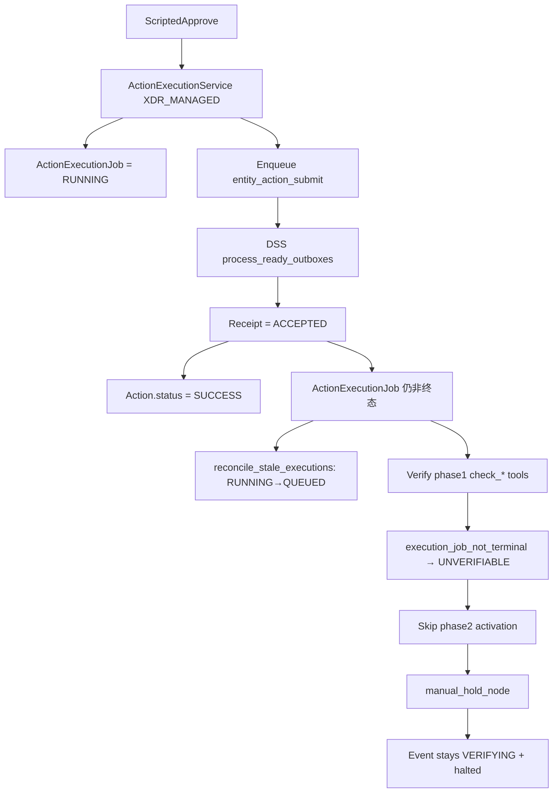

# Live 全链路复测问题深度调查报告

- **测试目录**: `/Users/apple/Desktop/shadowtrace-test-local`
- **运行时测试快照**: `3c3e6e915428af9e3d35e9177642a29bdd8bd0c7`
- **二次复核合同基准**: `main@44ff256c25cf302285c49025d3d5e7d0617b59f5`
- **产物**: `artifacts/live-eval-20260811-115115/`
- **栈配置**: `TASK_MODE=celery`，`WORKER=1` + `SCHEDULER=1`，`DISPOSITION_MODE=mock_xdr`，`LLM_MODE=openai_compatible`（glm-5.2，**非 MockGPT**）
- **调查方式**: 运行时证据 + 五路独立代码复核（Verify、FP、main 合同、Mock 替代方案、报告一致性）
- **证据等级**: `AUG11_OBSERVED`=本次运行时直接观察；`AUG10_HISTORICAL`=上次运行日志；`CODE_CONFIRMED`=main 代码合同直接证明；`INFERRED`=跨证据高置信推断；`REJECTED`=与证据或 main 合同冲突

---

## 1. 一句话结论

| 现象 | 二次复核裁定 | 是否真 LLM 导致 |
|------|----------------|-----------------|
| insider / domain **卡在 verifying** | **AUG11_OBSERVED + CODE_CONFIRMED**：XDR_MANAGED 执行后 **ActionExecutionJob 不落终态** + mock **不写 effect observation** → Verify 阶段 1判定不可验证 → manual_hold；阶段 2不激活 deferred `EVENT_STATUS_UPDATE` | **否**（LLM 只影响质量与耗时） |
| account_anomaly_fp 触发后首轮轮询即见 **failed** | baseline 容器路径错误、gold path 强制 full-loop 为 **CODE_CONFIRMED**；Aug10 600s soft-limit→FAILED 为 **AUG10_HISTORICAL**；Aug11 新触发是否同因仅为 **INFERRED**，且旧卷/确定性 event_id 污染不可排除 | **间接可能**，不是已证实直接原因 |
| 评测日志「Check evidence/entities…」 | **AUG11_OBSERVED + CODE_CONFIRMED**：脚本对任意 `status=failed` 使用固定提示，本次并非手工 POST/缺种子 | 文案误导 |

**CLOSED 未达成的主因不是「没用 MockGPT」，而是 mock_xdr 下 XDR_MANAGED ↔ Verify 的集成缺口 + FP 场景容器路径错误。**

---

## 2. 本次实测结果（证据）

| 场景 | event_id | 终态 | degraded_flags | 评测退出 |
|------|----------|------|----------------|----------|
| insider_data_exfiltration | `evt-20240615-420918b5` | **verifying** | `disposition_writeback_blocked=ready` | timeout 720s |
| suspicious_domain_access | `evt-20240615-a21c0948` | **verifying** | `event_type_from_heuristic=…`, `disposition_writeback_blocked=not_required` | timeout 720s |
| account_anomaly_fp | `evt-20240615-628d3dba` | **failed** | `[]`（本次） | gold-path FAILED |

已观察到的中间态（insider / domain）：

- `disposition_outbox`: `delivered` + `latest_writeback_status=accepted`（`entity_action_submit`）
- `disposition_receipt`: `accepted`，`simulated=true`，`confirmed_at=null`
- Action 行多为 `success`；**verify_*** Action 为 `failed`
- `action_execution_job`: **queued**（outbox 已 delivered）
- `graph_resume_intent`: **0 行**
- insider 的 deferred `EVENT_STATUS_UPDATE`（如 `act-b4a99e35`）长期停在 `approved` + `writeback_readiness=ready`

LLM 侧（`llm_call_log`）：planner/response/risk/RAG 有 success；另有 `triage_agent` timeout、`llm_invalid_json` —— 证明走了真模型，但不是 verifying 主因。

---

## 3. 卡在 verifying：根因链（insider / domain）



### 3.1 ResponseAgent 故意不把实体动作当「终态写回」

实体副作用动作：`writeback_required=True`，但 **`writeback_applicable=False`**，`writeback_readiness=NOT_REQUIRED`：

```434:435:backend/app/agents/response_agent.py
        # Entity side-effect actions inherit event policy but do not carry terminal writeback.
        return True, False, WritebackReadiness.NOT_REQUIRED, None
```

因此「实体收据停在 ACCEPTED」**不是** Verify 阶段 2 的主闸门；终态结案依赖后续 deferred `EVENT_STATUS_UPDATE`。

### 3.2 Mock 提交只给 ACCEPTED；DSS 只对终态 disposition 做 readback

Mock sync 路径明确：**写成功 ≠ 已确认**：

```750:755:backend/app/mock_xdr/state.py
        else:
            # Sync path: do NOT self-confirm instantly from write alone...
            status = WritebackStatus.ACCEPTED
```

DSS 仅在 `EVENT_STATUS_UPDATE` 上自动 `confirm_readback`：

```1280:1289:backend/app/services/disposition_sync_service.py
                # B1 fix (ISSUE-064): For EVENT_STATUS_UPDATE intents,
                # perform readback confirmation ...
                if (
                    command.intent_kind == DispositionIntentKind.EVENT_STATUS_UPDATE
                    and adapter.capabilities().supports_readback_confirmation
                ):
```

这对终态写回是**有意设计**；问题在于实体路径的 job/observation 未闭环，导致永远走不到终态写回。

### 3.3 真正的断裂：Job 不落终态 + 无 observation

DSS `_apply_action_terminal_from_receipt` **只改 Action 行**，不碰 `ActionExecutionJob`：

```1455:1473:backend/app/services/disposition_sync_service.py
        current = ActionStatus(action.status)
        if current is not ActionStatus.EXECUTING:
            return
        if receipt.status in {WritebackStatus.CONFIRMED, WritebackStatus.ACCEPTED}:
            target = ActionStatus.SUCCESS
        ...
        action.status = target.value
        action.executed_at = datetime.now(UTC)
```

结果：

1. Action = `success`，Job 仍 `RUNNING`/`QUEUED`
2. 租约过期后 `reconcile_stale_executions` 把 RUNNING **降级为 QUEUED**（与实测一致）
3. 仓库里虽有 `map_disposition_receipt_to_job`（`mock_provider.py`），**生产投递路径未接线**

二次复核纠正一个关键合同：现有 mapper 并不是 `ACCEPTED→SUCCESS`，而是：

- sync `ACCEPTED` → Job `RUNNING`
- async `ACCEPTED` + `provider_job_id` → Job `QUEUED`
- 仅 `CONFIRMED` → Job `SUCCESS`

这是有意区分「Action 执行主张」与「provider Job 终态」，不能为了绿测全局改成 ACCEPTED→SUCCESS。

Verify 工具对非终态 job 直接失败：

```206:223:backend/app/tools/verify/_common.py
# execution_job_not_terminal:{job.status}
```

→ Verify 工具返回 TIMEOUT/UNKNOWN（detail 包含 `execution_job_not_terminal:*`）→ VerifyAgent 映射为 `EffectStatus.UNVERIFIABLE` → `need_manual=True`。

即使将来 Job=SUCCESS，XDR_MANAGED 路径也**不会像 DIRECT_TOOL 那样写入 mock observation**；缺 observation 时 check_* 仍会判 `observation_missing`。因此 V-1 与 V-2 必须同时考虑；仅接线 mapper 不会解锁 Verify。

### 3.4 阶段 1 失败 → 跳过阶段 2 → deferred 终态处置永不执行

```899:925:backend/app/agents/verify_agent.py
        # If phase 1 already requires replan or manual, skip activation.
        if phase1_need_replan or phase1_need_manual:
            ...
            return (..., need_wb_recovery, need_manual)  # recovery 仍为 False
```

因此 insider 的 deferred `EVENT_STATUS_UPDATE` 一直 `approved` + `ready`，DSS 的自动 confirm 根本轮不到。

### 3.5 路由进 manual_hold，事件状态仍是 VERIFYING

`route_after_verify` 优先 manual → `manual_hold_node`，打上：

`disposition_writeback_blocked={event_status_update_readiness}`

| 场景 | readiness 标签 | 含义 |
|------|----------------|------|
| insider（policy=required） | `=ready` | 终态写回能力就绪，但被 hold 挡住 |
| domain（policy=not_required） | `=not_required` | **同一 phase1 失败**，只是标签不同 |

### 3.6 为何 `graph_resume_intent` 为空？

- `graph_resume_intent` 主要服务于 **MANUAL_RESOLUTION 的人工/回放解除**，不是 ACCEPTED 等待的自动泵
- hold 进入时**不会**自动塞一条「去 confirm 实体写回」的 intent
- 因此空表是**符合当前设计的现象**，不是 beat/worker 没起来的主因（本次已开 SCHEDULER）

### 3.7 ISSUE-302 的位置

Side-effect convergence 是 **CLOSED 门禁**，不是本次卡在 verifying 的第一推动力：

- insider（`disposition_policy=required`）：Job 仍 QUEUED / gate-applicable outbox 未 CONFIRMED 会继续挡 CLOSED；
- domain / FP（`not_required`）：side effect scope 为 `BACKGROUND_DETACHED`，不进入同一 CLOSED gate 分母。

因此「修好 Verify」与「required 场景真正 CLOSED」是两道验收，不能合并成一句“自然恢复”。

---

## 4. 触发后首轮轮询即见 failed：account_anomaly_fp

该现象只证明评测第一次读状态时已是 `failed`，**不证明该状态由本轮新 investigate transition 产生**。

### 4.1 评测脚本在说什么

```376:381:scripts/dynamic_eval_full_loop.py
            if status == "failed":
                raise RuntimeError(
                    f"gold-path FAILED for {event_id}. "
                    "Check evidence/entities (must use seed_mock_xdr_and_ingest, "
                    "not hand-crafted POST /events)."
                )
```

只要事件变成 `failed` 就抛这句——**与是否缺实体无关**。本次种子是金路径 `seed_mock_xdr_and_ingest`。

### 4.2 场景本意 vs 金路径强制 full-loop

`account_anomaly_fp` 设计为：

- `disposition_policy=not_required`
- 期望 `false_positive`（变更窗口内 ops 批量登录）
- 宿主 pytest / analysis-only e2e **可以**闭环

但 `eval-full-loop` **强制** `include_response_execution=true`，把 FP 场景推进长响应环。

### 4.3 Docker baseline 路径算错（代码 + Aug10 日志已确认）

```15:17:backend/app/services/change_window_baseline_loader.py
_DEFAULT_BASELINE_PATH = (
    Path(__file__).resolve().parents[3] / "data" / "organization" / "change_windows.json"
)
```

| 环境 | `parents[3]/data/...` | 真实文件位置 |
|------|------------------------|--------------|
| 宿主（`backend/app/services/...`） | `repo/data/...` | 正确 |
| 容器（`/app/app/services/...`） | **`/data/organization/...`** | Dockerfile 拷到 **`/app/data/...`** |

Aug10 worker 日志出现：`change-window baseline missing at /data/organization/change_windows.json`；Aug11 产物没有单独保存该 warning。

无 baseline → `FpAdjudicationService` 返回 `no_fp_signal` / `missing_conditions=["org_baseline_available"]`。但需修正因果：ISSUE-114 的 `route_after_fp_adjudication` 在 full-loop 下本就恒定继续，**不会因为 baseline 可用而 short-circuit**。FP 短闭环属于 `include_response_execution=false` 的 analysis-only profile。

### 4.4 Soft-limit 失败链：Aug10 已确认，Aug11 待补证

```495:500:backend/app/agents/super_agent.py
        except Exception as exc:
            ...
            await self._transition(
                event_id, EventStatus.FAILED, reason="exception", ec=event_context
            )
```

`run_investigation` 配置 `soft_time_limit=600`。异常先穿过 `SuperAgent.investigate` 的 catch-all（事件可能被写成 `FAILED`），再到任务层专用 `except SoftTimeLimitExceeded` 做 release lease、checkpoint fence、intent `mark_dead` 并 re-raise。两个层次必须一起评估，不能只改一层。

Aug10 同场景日志已有：`Soft time limit (600s) exceeded` → 随后 resume 风暴 / `graph_resume_failed`，此链为 **CONFIRMED**。Aug11 仅有脚本 trigger 后首轮观察到 `failed`，没有 worker soft-limit 日志、状态轨迹或 audit reason；同一确定性 event_id `evt-20240615-628d3dba` 曾在 Aug10 失败，因此「Aug11 也是新触发的 soft-limit」只能标为 **INFERRED**。

LLM timeout / invalid_json（ISSUE-299 默认不可重试）本身多走降级，**不直接**证明本次 `FAILED`；它们会拉长 full-loop，使 soft-limit 更容易命中。不能通过恢复盲重试或切回 MockGPT 来换绿。

---

## 5. 问题清单（按优先级）

### P0 — 阻全链路 CLOSED（mock_xdr + Celery demo）

| ID | 问题 | 证据 | 建议修复（工业级、低副作用） |
|----|------|------|------------------------------|
| **V-1** | XDR_MANAGED 投递后 **不持久化 receipt→ActionExecutionJob 状态，也没有 entity effect completion** | Action=success / Job=queued；DSS 无 Job 写入 | 第一步同事务接线 mapper，保留 ACCEPTED→RUNNING/QUEUED；第二步在 `mock_xdr + simulated` 下从 **provider-side applied state** 做独立 entity effect readback/completion，成功后产生 CONFIRMED/completion evidence，再由 mapper 推 Job SUCCESS。禁止从 ACCEPTED 或 Action SUCCESS 直接推导 Job SUCCESS |
| **V-2** | XDR_MANAGED **不提供 verify 所需独立 observation** | check_* 依赖 mock observation；DIRECT_TOOL 才写 | observation 必须由 provider effect readback 的独立 applied-state 结果生成，receipt/action 仅作关联键，并携带 writeback/job 溯源；不得从 ACCEPTED+Action SUCCESS 循环证明效果成立 |
| **V-3** | Phase1 失败后 **不激活** deferred `EVENT_STATUS_UPDATE` | 动作长期 approved+ready；阶段 2 skip | 保留 fail-closed；先修 V-1/V-2 使 phase1 有真实证据。insider 后续仍须通过 ISSUE-302 与 terminal disposition CONFIRMED，禁止 force_close 伪装 CLOSED |

### P1 — FP 场景 / 评测体验

| ID | 问题 | 证据 | 建议修复 |
|----|------|------|----------|
| **F-1** | change-window baseline **容器路径错误** | `/data/...` missing vs `/app/data/...` | 优先 Settings/env 显式路径；默认解析同时覆盖宿主 `repo/data` 与容器 `/app/data`，并校验文件存在及 tenant 内容。不要只改成 `parents[2]` 而破坏宿主 |
| **F-2** | gold-path 对 FP **强制 full-loop** | `include_response_execution=true`；FP adjudication 在 full-loop 不 short-circuit | 作为评测合同决策：matrix 按场景使用 analysis-only profile，并断言 FP CLOSED；不修改全局 strict 定义 |
| **F-3** | SoftTimeLimit 可能污染事件为 **FAILED** | Aug10 已证实；Aug11 未证实同因 | SuperAgent 不应把 SoftTimeLimit 当普通异常写 FAILED；任务层须原子选择 bounded retry 或明确终止，并保留 lease release/checkpoint fence，禁止留下“非终态 event + dead intent”、无限重试或单纯拉长超时 |
| **F-4** | 评测失败文案 **误导** | “Check evidence/entities” | 打印 status 轨迹、degraded_flags、audit reason、intent 状态 |

### P2 — 次级 / 放大项

| ID | 问题 | 说明 |
|----|------|------|
| **S-1** | 实体 intent 无 auto `confirm_readback` | 对终态设计合理；实体确认模型需另做（当前 readback 看 `target_disposition`，实体参数对不上） |
| **S-2** | ISSUE-302 CLOSED 收敛 | 仅 required 场景：Verify 修好后仍可能因 Job/实体 ACCEPTED outbox 挡 CLOSED；NOT_REQUIRED 为 background-detached |
| **S-3** | 真 LLM timeout / invalid_json | 质量与耗时问题；不要改回 MockGPT 来「假绿」 |
| **S-4** | 空 `graph_resume_intent` | verifying 卡死路径上多为预期；勿当成「没开 beat」 |

---

## 6. 与「故意设计」的边界

| 点 | 判定 |
|----|------|
| Mock 提交 ACCEPTED，readback 才 CONFIRMED | **保留**（provider truth） |
| 仅终态 disposition 自动 confirm_readback | **保留** |
| 实体动作 `writeback_applicable=False` | **保留**（终态写回另走 virtual disposition） |
| receipt→Job mapper 中 ACCEPTED 为 RUNNING/QUEUED | **保留**（Action 主张与 provider Job 终态分离） |
| Verify phase1 失败则跳过 phase2 | **保留**（fail-closed，不能为 demo 放宽） |
| manual_hold 时不自动创建 resume intent | **保留**（人工解除边界） |
| Demo/mock 下 XDR_MANAGED 不落 Job 终态、不写 observation | **缺陷**（坏处 ≫ 好处便利） |
| Docker baseline 指到 `/data` | **缺陷** |
| SoftTimeLimit 被普通异常路径写 FAILED | **过激**（任务层已有 fence/dead 语义，应协调为可恢复或明确终止） |

---

## 7. 建议修复顺序（冲 CLOSED）

1. **F-1** baseline 路径（小改，恢复 FP 裁决输入）
2. **V-1** receipt→Job 状态持久化（遵守 ACCEPTED/CONFIRMED 合同）+ 独立 provider entity effect readback/completion
3. **V-2** 由独立 applied-state readback 生成 scoped mock observation（解锁 insider/domain phase1）
4. **S-2 产品合同澄清**：required 场景 entity ACCEPTED outbox 如何进入 convergence scope，禁止以假 CONFIRMED 绕过
5. **F-2 / F-3 / F-4** 分场景评测、soft-limit 分层与可观测性
6. 回归：insider 用 full-loop strict；domain/FP 用明确的 full-loop 或 analysis-only profile；始终保持 `LLM_MODE=openai_compatible`

验收标准（建议）：

- [ ] 容器内 `load_change_window_baseline()` 非空（tenant-demo 有窗口）
- [ ] insider（REQUIRED）：Job/observation 可验证 → deferred disposition 投递并 readback CONFIRMED → ISSUE-302 side effects 全收敛 → **CLOSED**
- [ ] domain（NOT_REQUIRED）：analysis-only 验证场景语义；另以 full-loop 验证真实 phase1→REPORT→CLOSED，二者不可相互替代
- [ ] FP（NOT_REQUIRED）：fresh volume 下 analysis-only **CLOSED + false_positive**；full-loop 作为单独压力测试，不混用短路径验收
- [ ] `/health.llm.mode == openai_compatible`，且 `llm_call_log` 至少有一次真实 provider success

---

## 8. 调查来源

- 运行时产物：`artifacts/live-eval-20260811-115115/`（含旧版 `REPORT.md`）
- 并行代码调查：
  - [Verify 卡死链](2cf8cc3e-5d5d-4938-8d02-d3b2f0112906)
  - [FP 快速 failed](22fe9b19-9063-4600-805f-0aef88ec8f6a)
  - [Job / resume 旁路](aa07deeb-0bef-4c74-815d-0a605024cf40)
  - [Phase1 vs ACCEPTED 交叉核实](b4390273-f4ef-49c1-9426-e7a561e9a174)
- 二次复核：
  - [Verify/main 合同](6f804c7d-2515-4cb4-87e0-67a4ae824827)
  - [FP 证据等级](d5d8c5a5-4460-4d7d-9881-45bacb704243)
  - [Main 兼容性](642a127e-fb5e-4e12-a10c-d752d23dddbe)
  - [Mock 替代方案](8fddfcb9-e065-4df7-87c1-149c8c283352)
  - [独立审稿](79186d65-4c0e-4911-805d-e1ad49cdae88)

---

## 9. 修订说明（相对初版 REPORT）

初版把主因写成「实体 ACCEPTED → Verify 要 CONFIRMED」。交叉核实后收窄为：

1. **主因**：非终态 Job（+ 缺 observation）→ Verify 阶段 1 `UNVERIFIABLE` → manual_hold → 跳过阶段 2  
2. **实体 ACCEPTED 无 auto-confirm**：对 ResponseAgent 计划是**次级**；真正挡结案的是阶段 2 从未启动  
3. **空 resume 表**：多半不是 beat 故障  
4. **FP failed**：baseline 路径 bug 已确认；Aug10 soft-limit 已确认；Aug11 同因未证实，且需排除旧卷/确定性 event_id 污染  
5. **V-1 修法**：不能把 ACCEPTED 全局映射为 Job SUCCESS；该字面建议与 main mapper/测试合同冲突  
6. **场景分叉**：insider required 需 phase2+convergence；domain/FP not_required 不应照搬同一验收

---

## 10. 二次独立复核附录（五路审查，基准 `main@44ff256`）

### 10.1 对初版的六问总裁定（所列修订已纳入最终正文）

| 复核问题 | 裁定 | 关键修订 |
|----------|------|----------|
| 1. 是否有遗漏 | **有** | mapper 的 ACCEPTED 状态合同、ISSUE-302 对 required entity outbox 的独立门禁、domain/FP 与 insider 分叉、soft-limit 双层处理、旧卷/确定性 event_id 污染、已有 adversarial verify 桥 |
| 2. 是否不实 | **部分不实/过度** | 驳回“ACCEPTED→Job SUCCESS”全局修法；Aug11 soft-limit 直接因果从 CONFIRMED 降为 INFERRED；baseline 不会让 full-loop 自动 short-circuit |
| 3. 是否相互冲突 | **原报告有冲突，已修正** | provider truth（ACCEPTED≠CONFIRMED）与 V-1 原建议冲突；“V-1/V-2 自然 CLOSED”与 ISSUE-302 冲突；三场景同一验收与 F-2 冲突 |
| 4. 修复后是否与 main 冲突 | **合同安全版不冲突** | F-1/F-4 可直接修；V-1 必须尊重现有 mapper；V-2 必须 scoped；F-2 作为 per-scenario eval profile；F-3 保留任务层 fence/dead |
| 5. 是否故意设计且利大于弊 | **多处是，必须保留** | ACCEPTED/readback、实体不承载终态写回、phase1 fail→skip phase2、manual hold、UNKNOWN 禁盲重试、force_close 逃生舱、NOT_REQUIRED background-detached |
| 6. Mock 下是否只能如此 | **不是** | 有六类替代；只有完整 XDR_MANAGED 集成桥同时覆盖主路径与 strict CLOSED，其余多为分场景、偏离主路径或假绿 |

### 10.2 遗漏项清单

1. **Action 与 Job 是两个合同面**：DSS 可在 ACCEPTED 后把 Action 标 SUCCESS；Job mapper 仍必须保持非终态，不能混为一谈。
2. **同一 Job 缺口影响两道门**：先导致 Verify phase1 `UNVERIFIABLE`，后在 required 场景触发 ISSUE-302 `IN_FLIGHT_JOB`。
3. **entity ACCEPTED outbox 的 convergence scope 未决**：即使 Job/observation 修好，insider 仍可能因 `OUTBOX_NOT_CONFIRMED` 无法 CLOSED。
4. **domain 与 insider 不同**：domain 为 NOT_REQUIRED，修好 phase1 后可直接去 report/close；不要求 terminal disposition phase2。
5. **FP 运行时证据不完整**：Aug11 未保存 worker log、status trace、transition audit、investigation intent error。
6. **fresh-volume 污染风险**：场景使用确定性 event_id；Aug10 与 Aug11 FP 是同一 ID，单次 `eval-full-loop` 不如 matrix 的 fresh project/volume 隔离可靠。
7. **已有替代代码未写入初版**：`backend/tests/adversarial/xdr_verify_observation.py` 可从 Action+receipt 推导验证，但目前是测试 harness，不应直接注入 gold path。
8. **health 不检查 baseline 可读性**：应用 health=ok 并不证明 change-window baseline 在容器内加载成功。

### 10.3 不实与证据等级复核

| 主张 | 最终裁定 | 原因 |
|------|----------|------|
| Verify 卡死主链 | **AUG11_OBSERVED + CODE_CONFIRMED** | 运行时 Action=success、Job=queued、verify_*=failed、deferred approved；代码链一致 |
| XDR_MANAGED 缺 observation | **CODE_CONFIRMED** | observation 仅由 DIRECT_TOOL MockToolProvider 写入 |
| 空 `graph_resume_intent` 是 scheduler 故障 | **REJECTED** | manual hold 进入时不自动创建 intent；该表用于解除/回放，不是 ACCEPTED pump |
| baseline 容器路径错误 | **CODE_CONFIRMED + AUG10_HISTORICAL** | `/app/app/services` 的 `parents[3]` 得 `/`，而 Dockerfile 将 data 放 `/app/data`；Aug10 warning 佐证 |
| Aug11 FP 必然由 600s soft-limit 导致 | **INFERRED** | Aug10 有直接日志；Aug11 只有首轮见 `failed`，缺 worker/audit 证据 |
| baseline 可用会让 full-loop early close | **REJECTED** | ISSUE-114 下 `route_after_fp_adjudication` 恒继续 |
| 接线 mapper 即可修 Verify | **REJECTED** | ACCEPTED 仍映射 RUNNING/QUEUED；即使 Job 终态仍缺 observation |
| 换 MockGPT 可以解决 | **REJECTED** | 根因在 execution/verify/disposition plumbing |

### 10.4 相互冲突复核

以下冲突已在正文消解：

- **Provider truth vs 原 V-1**：ACCEPTED 不能全局伪装 CONFIRMED/SUCCESS。
- **Verify 通过 vs CLOSED 通过**：V-1/V-2 解决 phase1，不自动解决 required 的 ISSUE-302 convergence。
- **FP analysis-only vs 三场景 full-loop**：改为 per-scenario profile；不修改全局 strict 定义。
- **manual hold vs auto resume**：保留人工解除边界，不能靠空 resume intent 自愈前置证据缺口。
- **domain `not_required` 标签 vs 根因**：标签只表示 policy/readiness，不代表 phase1 没问题。

### 10.5 与当前 main 的兼容性矩阵

| 建议 | main 合同 | 冲突级别 | 合同安全修法 |
|------|-----------|----------|--------------|
| F-1 baseline 路径 | main 仍指 `/data/...` | 无 | Settings/env 显式路径；fallback 同时支持宿主 repo/data 与容器 `/app/data`；加内容 health/assert |
| V-1 receipt→Job | mapper 锁定 ACCEPTED→RUNNING/QUEUED | 原建议高；修订后低 | 持久化现有 mapper，不改全局状态语义；同事务避免 reclaim 竞态 |
| V-2 observation bridge | live provider truth / Mock 状态分离 | 中 | 仅 `mock_xdr + simulated=true`；必须绑定 action/job/writeback；live 禁用 |
| S-2 entity convergence scope | ISSUE-302 required fail-closed | 产品决策 | 明确 entity `writeback_applicable=false` 是否只检查 Job/effect 而不要求 outbox CONFIRMED；不得直接删除 gate |
| F-2 FP analysis-only | ISSUE-301 strict profile | 低 | matrix per-scenario profile，不改变 insider full-loop |
| F-3 soft-limit | task 层已有 fence + intent dead | 中 | SuperAgent 不将 SoftTimeLimit 当普通异常；任务层原子 bounded retry 或明确终止，禁止非终态 event + dead intent |
| F-4 失败诊断 | 纯评测脚本 | 无 | 输出 elapsed/status trace/flags/audit/intent |

当前 feature branch 为 ISSUE-308 RBAC；本报告只修改 Markdown。上述建议不要求改变 `force_close` 的逃生舱语义，和 ISSUE-308「服务层补 admin RBAC、仍绕过 gate 并标 external_unsynced」一致。

### 10.6 故意设计：应保留

| 设计 | 好处 | 坏处 | 最终判定 |
|------|------|------|----------|
| Mock submit=ACCEPTED，readback=CONFIRMED | 保留 provider truth，防写成功冒充效果确认 | demo 需额外确认/观测桥 | **保留** |
| 仅 EVENT_STATUS_UPDATE 自动 readback | 终态处置有明确 provider 状态 | entity 不会自然 CONFIRMED | **保留**；另建 entity effect 观测 |
| 实体 `writeback_applicable=false` | 终态写回与实体执行分离 | 容易误读 ACCEPTED 为 phase2 主因 | **保留** |
| ACCEPTED→Job RUNNING/QUEUED | 避免异步任务假终态/重复执行 | mock sync 易卡 Verify | **保留全局合同**；mock 需 bridge |
| phase1 fail→skip phase2 | 未验证副作用时 fail-closed | mock 集成缺口被放大 | **保留** |
| manual hold + 无自动 resume intent | 人工解除有审计边界 | 无人处理会长期 VERIFYING | **保留**，提升可观测/告警 |
| UNKNOWN/LLM timeout 不盲重试 | 防双投和重复副作用 | 恢复需显式确认 | **保留** |
| NOT_REQUIRED background-detached | 分析/FP 可快速结案 | 后台副作用不阻塞终态 | **保留** |
| force_close 绕 gate + external_unsynced | admin 灾难恢复逃生舱 | 可产生假闭环 | **保留但禁 gold path**；由 ISSUE-308 加固 RBAC |
| Gold path 强制 full-loop | 能测试完整响应链 | 不适合所有 NOT_REQUIRED 场景 | **保留默认**；matrix 分场景 profile |

### 10.7 Mock 条件下的替代方案

| 方案 | 能否 strict CLOSED | 语义/安全性 | 裁定 |
|------|--------------------|-------------|------|
| **A. receipt→Job 持久化 + provider effect completion/readback + scoped observation bridge** | 是（还需 terminal disposition + convergence） | applied-state 独立于 receipt/action 主张；最接近 production 主路径；低假绿 | **首选** |
| **B. Demo 强制 DIRECT_TOOL** | 可，但测不到 XDR_MANAGED | 偏离 disposition 主路径 | 仅辅助 smoke，不作 gold |
| **C. Mock async job polling/readback** | 可，仍需 observation | 最接近真实异步 provider，但改动大 | 长期方案 |
| **D. Verify adapter 直接读 Action+receipt** | 测试可达 | ACCEPTED 当 verified 的证据较弱；已有 adversarial harness | 保留审计测试，禁 live gold |
| **E. NOT_REQUIRED analysis-only** | FP/domain 可 | 场景语义真实，不覆盖 insider | 推荐场景分流 |
| **F. Manual resolution / force_close** | 伪 CLOSED 或根因仍在 | 高假绿；force_close 会 external_unsynced | **禁止验收** |

结论：Mock 下**并非只能** seed observation。首选 A，且 observation 只能来自 provider-side applied-state readback，不能从 ACCEPTED/Action SUCCESS 循环推导；E 用于 FP/domain 的场景语义验证；C 可做未来的 live-like 模拟。B/D/F 不能替代 required 主路径验收。

### 10.8 合同安全版修复与验收顺序

1. 修 F-1，并在容器内断言 baseline 可加载。
2. 接线 V-1 的 Job 持久化，保持现有 mapper 契约；新增 mock entity provider effect completion/readback，只有独立 applied-state 成功后才能推进 Job SUCCESS。
3. 由该 applied-state readback 生成 V-2 scoped observation，证明 check_* 读取的效果不是 ACCEPTED/Action SUCCESS 的循环证明。
4. 对 required entity outbox 的 ISSUE-302 scope 做显式合同决策和测试，不能以假 CONFIRMED 规避。
5. 协调 soft-limit 两层语义，补 status trace / audit reason。
6. fresh-volume 回归：
   - insider：full-loop strict CLOSED，且 `external_unsynced=false`；
   - domain：analysis-only 验场景语义，full-loop 另验真实 phase1；二者都通过；
   - FP：analysis-only CLOSED + false_positive；
   - 全部保持 `LLM_MODE=openai_compatible`，禁止 force_close/MockGPT。

### 10.9 二次复核结论

报告的 **Verify 主链与 baseline 路径诊断可信**；初版最大的错误是 V-1 把 ACCEPTED 与 Job SUCCESS 混为一谈，以及把 Aug10 的 soft-limit 因果直接套到 Aug11。最终版已改为独立 provider effect completion/readback，避免 receipt/action 循环证明，并明确 soft-limit 证据边界。结论与 `main@44ff256` 的 provider-truth、ISSUE-299、ISSUE-301、ISSUE-302、ISSUE-308 合同一致，可作为后续拆 issue 与实现评审的依据。
